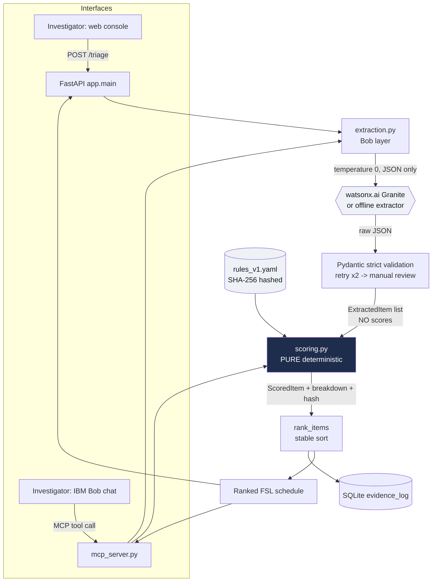

# Architecture

## System diagram

The dark node (`scoring.py`) is the trust boundary: **data crosses from the LLM
side to the deterministic side there, and only structured, validated items — never
scores — cross it.**

## Components

| Component | Tech | Responsibility |
|---|---|---|
| `web/index.html` | HTML/JS | Console; calls `/triage`, offline mirror fallback |
| `app/main.py` | FastAPI | `/extract`, `/score`, `/triage`, `/audit`, `/health` |
| `app/mcp_server.py` | MCP | `extract_evidence`, `score_evidence`, `triage_scene` tools for IBM Bob |
| `app/extraction.py` | Python | Prompt, strict-validate, retry, manual-review fallback |
| `app/llm_client.py` | ibm-watsonx-ai | Granite client + deterministic offline client |
| `app/scoring.py` | Python + Decimal | **Pure** score + urgency + rank. No LLM, no I/O |
| `app/rules.py` | Pydantic + YAML | Load + SHA-256 hash rules; condition normalization |
| `app/audit.py` | SQLite | One row per scored item; replay past runs |
| `rules_v1.yaml` | YAML | Single source of truth for every weight |

## Data flow, end to end

1. `raw_text` + `crime_type` arrive at `/triage` (or the MCP `triage_scene` tool).
2. `extract_items()` calls the model (temp 0), parses JSON, validates each object
   strictly. Bad objects trigger retries; unresolved ones become manual-review
   stubs. **Output: `list[ExtractedItem]` with no scores.**
3. `score_and_rank()` scores each valid item purely from `(item, crime_type, rules)`,
   attaches the full breakdown and the ruleset hash, then ranks with an explicit
   stable key.
4. `audit.log_run()` writes every item (raw extraction JSON + score breakdown +
   hash + UTC timestamp) to SQLite.
5. The ranked schedule returns to the caller; `/audit/{session_id}` can replay it
   later with no model call.

## Where IBM Bob is load-bearing

Two integration paths, same engine:

- **MCP (primary story):** the investigator talks to **IBM Bob**; Bob calls
  `extract_evidence` (its language strength) and then **must** call `score_evidence`
  (deterministic) to get priorities. Bob cannot shortcut the scoring — the tool
  boundary enforces the design rule.
- **API + watsonx (embedded):** the FastAPI `/triage` route uses watsonx Granite
  as the extraction model directly, for the web console.

## Security & reproducibility notes

- `.env` (real watsonx credentials) is git-ignored; `.env.example` ships dummy
  values. The scoring engine needs no secrets.
- Reproducibility is a tested property: `tests/test_determinism.py` runs the scorer
  1000× and asserts identical output; `tests/test_scoring.py` pins exact numbers.
- Every result is traceable to a ruleset via its SHA-256 hash, surfaced in
  `/health`, in each `ScoredItem`, and in the audit log.
